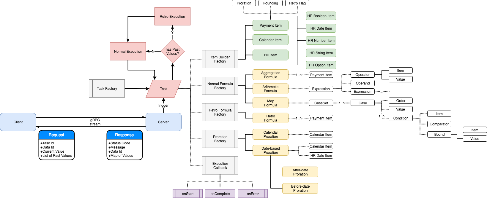

# A Item-based Payroll System

A **extensible** and **scalable** payroll system based on items and related rules.

## Overview

* [X] [Calc Core](/calc-core/README.md), 
    The core functions and components related to the calculation.
    
* [ ] Component Storage, 
    The accessor of components from persistent storage.
* [ ] Service Controller, 
    A centerlized controller to manage all servers and tasks running on it.
* [ ] UI, 
    How user interact with this system.

## Build
Build with command:
```bash
mvn clean jacoco:prepare-agent install jacoco:report sonar:sonar
```

